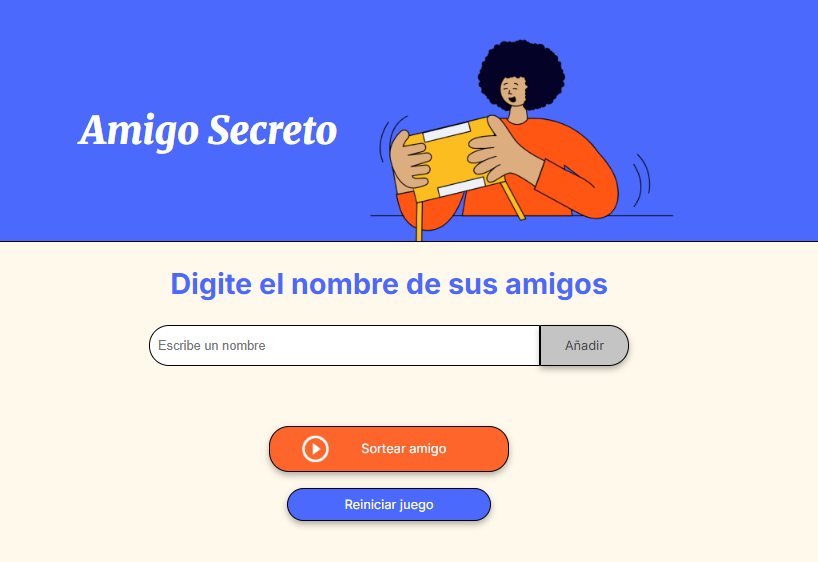
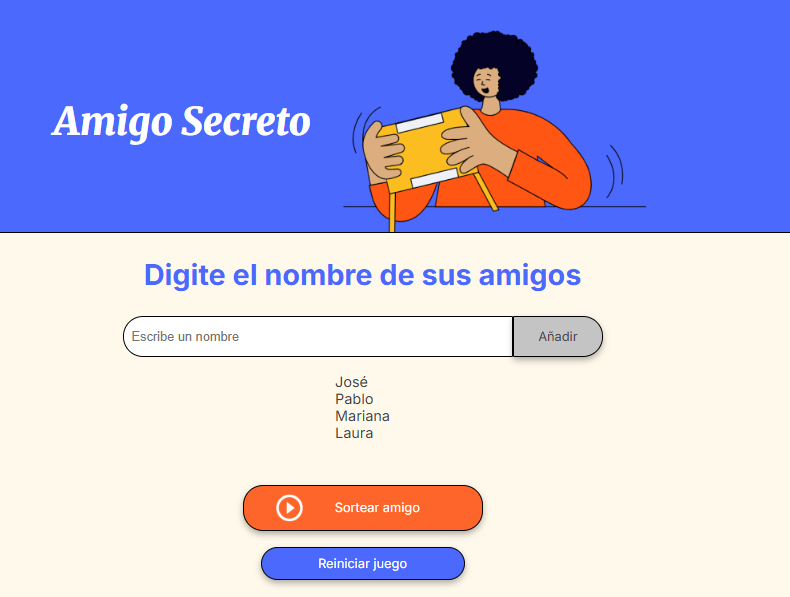
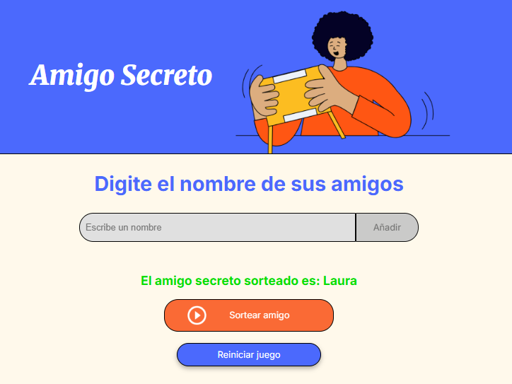

<h1 align="center">🎁 Challenge Amigo Secreto</h1>

  
  
  

## 📚 Sobre el Challenge
Este proyecto forma parte del programa **Oracle Next Education (ONE) - G9** en colaboración con **Alura Latam**.  
Corresponde al challenge **"Amigo Secreto"** de la ruta *Principiante en Programación*.

---

## 📝 Descripción general
La aplicación **Amigo Secreto** permite:
- Ingresar nombres en una lista.
- Mostrar los nombres agregados en pantalla.
- Realizar un sorteo aleatorio para elegir al "amigo secreto".
- Reiniciar el juego para comenzar desde cero.

Su objetivo es aplicar conceptos de **lógica de programación** usando JavaScript:
arrays, funciones, validaciones y manipulación del DOM.

---

## 📷 Imágenes del proyecto

<table>
  <tr>
    <td>
      <ul>
        <li><strong>Vista de la aplicación</strong></li>
        <li><strong>Lista de amigos cargada</strong></li>
        <li><strong>Resultado del sorteo</strong></li>
      </ul>
    </td>
    <td>
      
      
      
    </td>
  </tr>
</table>

---

## ⚙️ Funcionalidades específicas

- **`agregarAmigo()`** → agrega un nombre a la lista de amigos e incluye una función que valida las entradas.  
- **`validarNombre()`** → comprueba que el nombre no esté vacío, no se repita, no tenga números ni supere los 20 caracteres.  
- **`actualizarListaAmigos()`** → muestra la lista de amigos actualizada en la pantalla.  
- **`sortearAmigo()`** → selecciona aleatoriamente un nombre de la lista y da por finalizado el juego (deshabilita ingresos).  
- **`reiniciarJuego()`** → borra la lista de amigos y el resultado del sorteo, para reiniciar el juego.  

---

## 🛠️ Tecnologías Utilizadas

- **HTML5** – Estructura del contenido de la página (proporcionado por Alura)
- **CSS3** – Estilos y diseño de la interfaz (proporcionado por Alura)
- **JavaScript (ES6+)** – (realizado por el alumno)
  Lógica del front-end para:
  - Manipulación del DOM
  - Manejo de eventos
  - Validación de datos
  - Sorteo aleatorio
  - Control de estados de la aplicación

---

## ✒️ Autor
- **Alumna: Mariana Aiello**

| [ Mariana Aiello](https://https://github.com/Aiello-M) |
| :---: |

---
